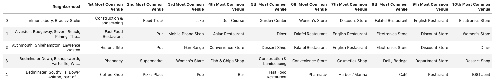
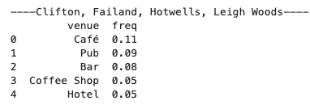
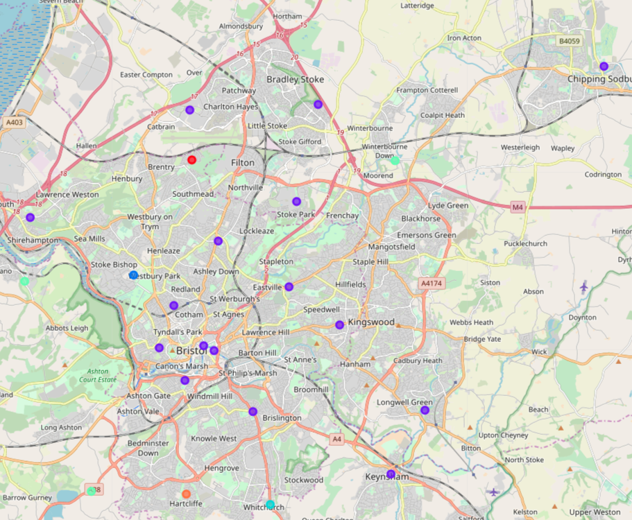
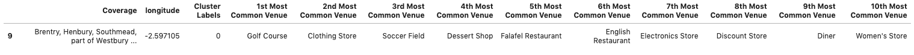
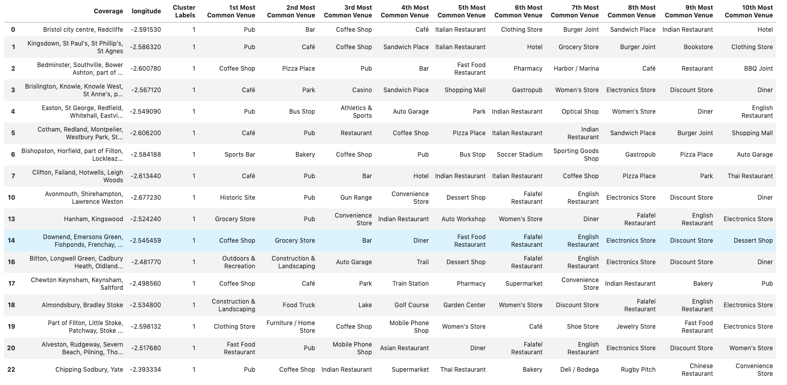
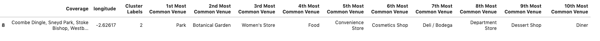
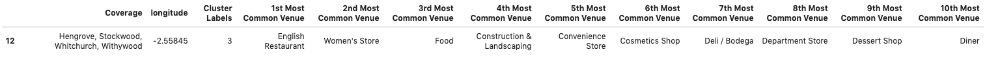
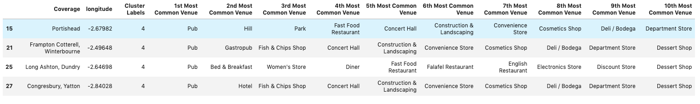
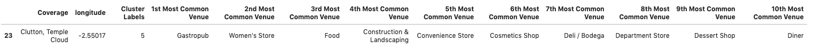
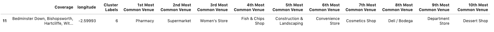

# Introduction

This project will be aimed at identifying suitable areas in Bristol (UK) for home hunters to purchase a property. Many young adults, when looking to purchase their first property, would benefit from analysis of the amenities in the surrounding area. By utilising geospatial data and the fourSquared API this project will be able to identify and cluster neighbourhoods based on their surrounding amenities/venues.

__**Business Question**__

Can we utilise geospatial data, relating to bristol and it's neighbourhoods, combined with the use of fourSquared API to cluster potential living areas based on surrounding amenities/venues.

# Data

Utilising the following stages:

1. __Analytic Approach__
- Kmeans clustering, to categorise similar neighbourhoods.
2. __Data Requirements__
- The data produced would need to satisfy business objectives, be understood by all stakeholders and meet the needs of the business processes that create and use the data. I would ensure we have the correct methods for collecting the data snd that it covers all aspects of what we are trying to achieve.
3. __Data Collection__
- This stage would identify any gaps within the data identified and if the requirements need to be revised.

4. __Data Understanding and Preparation__

- vital to success. It would involve cleaning the data, removing duplicates, feature engineering, normalising the data and eye balling data types etc.

Data will be collected from wikipedia (https://en.wikipedia.org/wiki/BS_postcode_area) to create a list of post codes and areas. The following website will be used to create a list of corresponding coordinates.(https://www.findlatitudeandlongitude.com/?loc=bristol%252C+england#.XbLeE5NKilM)

FourSquared API will be used to capture data relating to the surrounding venues in the area.

The following is an example post enrichment, where we are able to see the top 10 most common venues for each Neighbourhood in Bristol:

# Methodology

The following image is an example of the raw data:

To visualise this data using Folium, a data set was crafted containing coordinates for each unique value of 'Postcode district' - Culminating in the following dataset:

This enabled me to visualise Bristol neighbourhoods on an interactive plot utilising the Folium library.

On first inspection it was interesting to see the number of unique values per column:

This suggests 'Postcode district' and 'Coverage' have the lowest entropy.

**Post fourSquared data**

_A local search-and-discovery app developed by Foursquare Labs Inc. The app provides personalized recommendations of places to go near a user's current location based on users' previous browsing history and check-in history._

The FourSqared developers api was utilised to enrich data with venues/'things to do' around the different neighbourhoods in Bristol.

The Following graph shows a count of venues and a count of venue 'type' at each location:
(As expected, they are highly correlated)

Digging deeper the top 5 most popular venues per neighbourhood was calculated. A very useful statistic when house hunting:

Example:

One hot encoding was used to convert categorical variables into a form that can be provided to machine learning algorithms. In this case Kmeans clustering was used to place neighbourhoods with similar venues/things to do in the same clusters. This produced the following output:

# Results

**Cluster Results**

**Discussion**

The clusters created by the Kmeans algorithm were then analysed. The results suggest that most neighbourhoods around Bristol have similar venues/things to do - As show in cluster 2 containing a wide array of neighbourhoods with similar venues.

Cluster 2 (Shown in purple on the map) - has a good mixture of pubs, bars and restaurants. In contrast Cluster 3 (Shown in Blue) has a nice park and Botenical Gardens in the vicinity. Maybe this area would be more suited to the elderly or someone looking for a more tranquil area to live.

To improve the results more data would need to be incorporated. Data relating to transport, work places and crime rates could be included to deepen the understanding of each neighbourhood.

# Conclusion

In conclusion, the business question has been met - It is possible to cluster Bristol neighbourhoods based on surrounding amenities/venues. The results could then be used to advise home hunters on which neighbourhood would be best suited to them.

The process could be improved by incorporating a more varied dataset but initial results show good potential.
