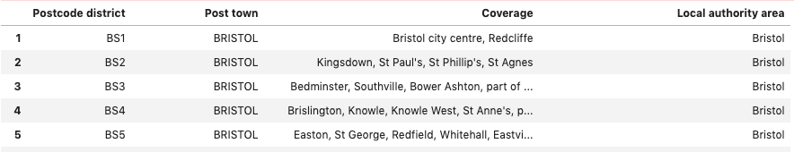

# Introduction

This project will be aimed at identifying suitable areas in Bristol (UK) for home hunters to purchase a property. Many young adults, when looking to purchase their first property, would benefit from analysis of the amenities in the surrounding area. By utilising geospatial data and the fourSquared API this project will be able to identify and cluster neighbourhoods based on their surrounding amenities/venues.

__**Business Question**__

Can we utilise geospatial data, relating to bristol and it's neighbourhoods, combined with the use of fourSquared API to cluster potential living areas based on surrounding amenities/venues.

# Data

Utilising the following stages:

1. __Analytic Approach__
- I would suggest using a machine learning technique, possibly kmeans clustering.
2. __Data Requirements__
- The data produced would need to satisfy business objectives, be understood by all stakeholders and meet the needs of the business processes that create and use the data. I would ensure we have the correct methods for collecting the data snd that it covers all aspects of what we are trying to achieve.
3. __Data Collection__
- This stage would identify any gaps within the data identified and if the requirements need to be revised.

4. __Data Understanding and Preparation__

- vital to success. It would involve cleaning the data, removing duplicates, feature engineering, normalising the data and eye balling data types etc.

I will be collecting data from wikipedia (https://en.wikipedia.org/wiki/BS_postcode_area) to create a list of post codes and areas. I will then use the following website (https://www.findlatitudeandlongitude.com/?loc=bristol%252C+england#.XbLeE5NKilM)to create a list of corresponding coordinates.

I will then use the fourSquared API to capture data relating to the surrounding venues in the area.

# Methodology

The following image is an example of the raw data:

To visualise this data using Folium I crafted a data set containing coordinates for each unique value of 'Postcode district' - Culminating in the following dataset:

This enabled me to visualise Bristol neighbourhoods on an interactive plot utilising the Folium library.

On first inspection it was interesting to see the number of unique values per column:

This suggests 'Postcode district' and 'Coverage' have the lowest entropy.

## Post fourSquared data

_A local search-and-discovery app developed by Foursquare Labs Inc. The app provides personalized recommendations of places to go near a user's current location based on users' previous browsing history and check-in history._

The FourSqared developers api was utilised to enrich our data with 'things to do' around the different neighbourhoods.

The Following graph shows a count of venues and a count of venue 'type' at each location:
(As expected, they are highly correlated)

 
